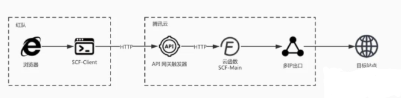

# 💡 scf-proxy 云函数代理

白嫖云函数，构建自己的代理服务

基于https://github.com/Sakurasan/scf-proxy修改

## 更新
1. 增加http/2协议转发\
需关闭ALPN，例如：Firefox about:config security.ssl.enable_alpn=false
2. 支持浏览器代理
3. 原有的命令行方式改为yaml配置文件
## 快速食用🍰
```
sh build.sh

https://console.cloud.tencent.com/scf/list?rid=1&ns=default

上传 zip 包并布署
```
## 原理 📌


## 效果展示 🎈


# Reference
https://freewechat.com/a/MzI0MDI5MTQ3OQ==/2247484068/1

https://github.com/copriwolf/serverless-transitcode

http://www.lyyyuna.com/2018/03/16/http-proxy-https/

https://github.com/lyyyuna/mitm

https://api.bilibili.com/x/web-interface/zone

https://mp.weixin.qq.com/s/lRdVqBKlR708tGGXQxjUWA
https://github1s.com/google/martian/blob/master/proxy.go
https://github1s.com/google/martian/blob/master/mitm/mitm.go

https://github.com/getlantern/mitm/blob/master/mitm.go
https://github.com/getlantern/keyman

---
[](https://dartnode.com "Powered by DartNode - Free VPS for Open Source")
